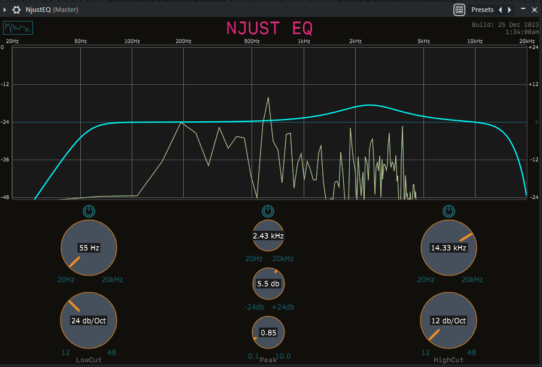
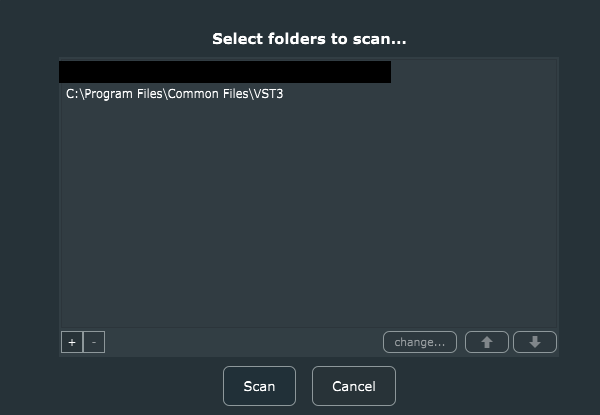

# NJUST EQ VST Plugin Manual

---



### Using NJUST EQ VST Plugin

**System Requirements:**

- Operating System: Windows 10, macOS, or Linux
- Audio Host/DAW (optional)

**Included Files:**

- NJUST EQ VST3 Build Folder
- Standalone Version Application
- Simple Audio Plugin Host Application

---

## Method 1: Integrating with a DAW (VST3 Installation)

### Step 1: Install NJUST EQ VST3 Plugin

1. Locate the VST3 Build Folder in the provided package for your desired build. (eg. `Builds\VisualStudio2022\x64\Debug\VST3\NjustEQ.vst3` for windows)
2. Copy the entire VST3 Build Folder (e.g., theEQ_VST3) to the default VST3 installation location based on your operating system:
   - **Windows:** `C:\\Program Files\\Common Files\\VST3`
   - **macOS:** `/Library/Audio/Plug-Ins/VST3`
   - **Linux:** `/usr/lib/vst3` or `/usr/local/lib/vst3`

### Step 2: Load NJUST EQ Plugin in Your DAW

1. Open your preferred Digital Audio Workstation (DAW) on your Windows, macOS, or Linux system. (can be Ableton, Reason, FL Studio, Cubase)
2. Create a new audio track or open an existing project.
3. Access the plugin browser in your DAW and locate NJUST EQ plugin.
4. Load NJUST EQ onto an audio track or within the plugin chain of your choice.

### Step 3: Adjust and Use NJUST EQ Plugin

1. Configure NJUST EQ parameters as desired for your audio processing needs.
2. Route your audio through NJUST EQ plugin by adjusting the track's input/output settings.
3. Play the audio in your project to experience NJUST EQ's effects.

---

## Method 2: Using the Standalone Version (`Windows Only`)

### Step 1: Launch NJUST EQ Standalone Application

1. Locate and open `NjustEQ.exe` Standalone Application included in the folder.
2. Upon opening, NJUST EQ standalone interface will appear.

### Step 2: Configure Audio Input

1. In NJUST EQ standalone interface, navigate to the settings or preferences section.

   

2. Choose the appropriate audio input device (e.g., microphone, line-in) from the available options.


### Step 3: Use NJUST EQ Plugin

1. Adjust NJUST EQ's settings and parameters according to your preferences within the standalone interface.
2. Ensure your audio input source is connected and active.
3. Start or play the audio source to apply NJUST EQ's effects to the incoming audio.

---

## Additional Information: Using Simple Audio Plugin Host Application

In the absence of a DAW, the provided Simple Audio Plugin Host Application can be used to load and utilize NJUST EQ VST plugin:

1. Locate and open the Simple Audio Plugin Host Application included in the folder.

   `extra\AudioPluginHost\App` - open `AudioPLuginHost.exe`(Windows)

   

2. Navigate to the plugin loading section or preferences within the application

   

   

3. Select and load NJUST EQ VST plugin from the available list of plugins.

   

   

4. Configure settings within the Simple Audio Plugin Host Application and use NJUST EQ plugin similarly to the standalone version.

   

---

### Linux Specific Instructions

For Linux users, ensure proper permissions for the VST3 installation directory (`/usr/lib/vst3` or `/usr/local/lib/vst3`) to copy NJUST EQ VST3 Build Folder. You might require administrative privileges or use the `sudo` command to copy files into system directories.

### Example (Terminal Commands):

```bash
# Navigate to theEQ VST3 Build Folder location
cd /path/to/theEQ_VST3

# Copy theEQ VST3 Build Folder to the VST3 installation directory
sudo cp -R theEQ_VST3 /usr/lib/vst3
# or
sudo cp -R theEQ_VST3 /usr/local/lib/vst3
```
